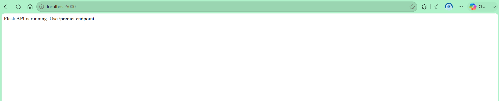
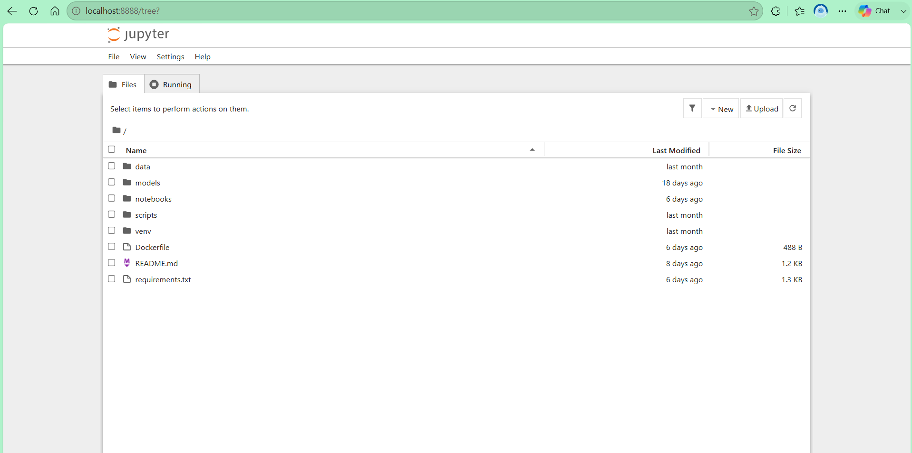
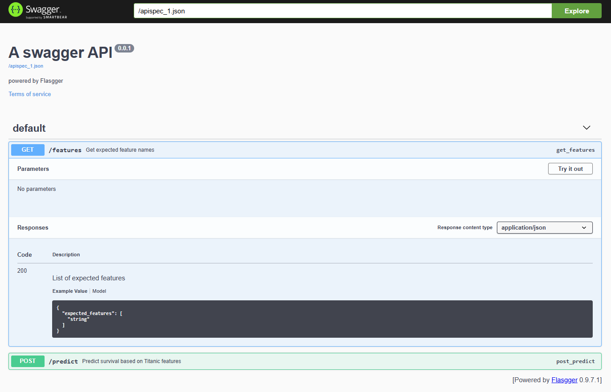
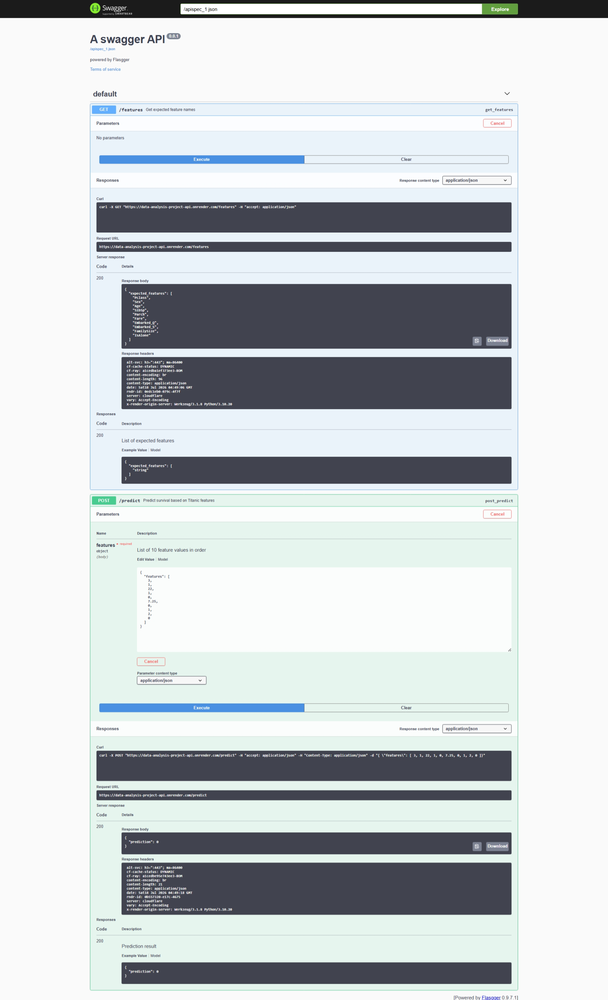
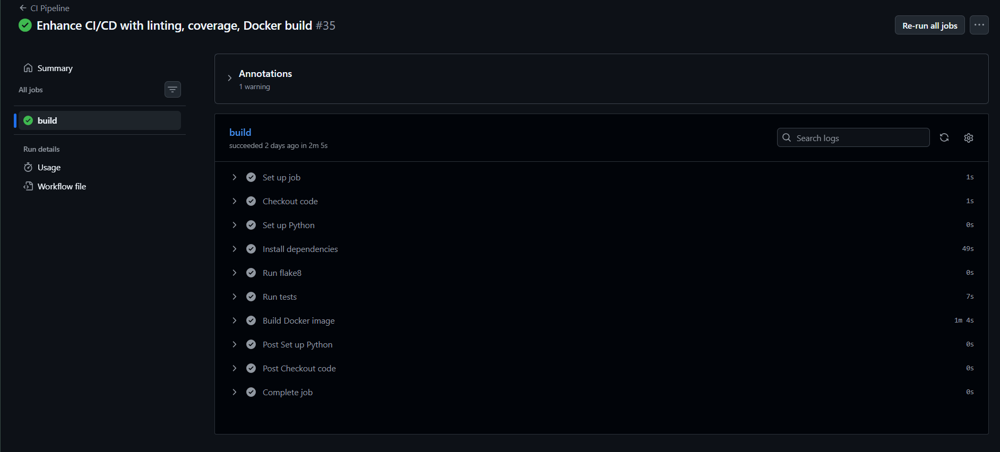
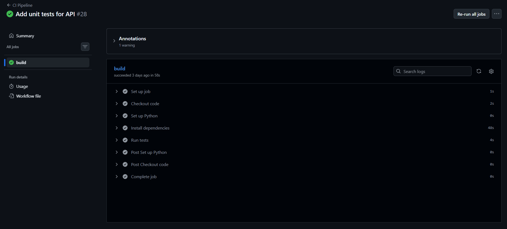
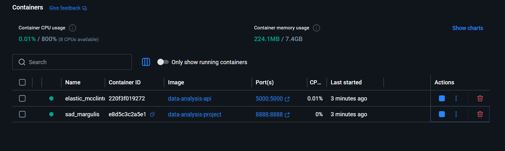

# 🚢 Titanic Survival Prediction API

> A production-ready Machine Learning REST API built with **Flask**, **Scikit-learn**, and **Docker** to predict Titanic passenger survival.
>
> This project was completed as part of a **30-Day Machine Learning & Backend Development Challenge**, covering data preprocessing, machine learning, REST API development, testing, Docker, CI/CD, and cloud deployment.

---

## Badges


---

# Project Overview

The **Titanic Survival Prediction API** is an end-to-end Machine Learning project that predicts whether a passenger would survive the Titanic disaster based on passenger information.

The project demonstrates the complete Machine Learning lifecycle, including:

- Data preprocessing
- Exploratory Data Analysis (EDA)
- Feature Engineering
- Model Training
- Hyperparameter Tuning
- Model Evaluation
- Model Deployment
- REST API Development
- Docker Containerization
- Automated Testing
- Continuous Integration (CI/CD)
- Cloud Deployment

This project was developed as part of a structured **30-day learning journey** to gain practical experience in Machine Learning Engineering and Backend Development.

---

# Features

- Titanic survival prediction using Machine Learning
- Flask REST API
- Random Forest model
- Gradient Boosting model
- Docker support
- Automated testing with Pytest
- GitHub Actions CI/CD
- Swagger API Documentation
- Cloud deployment on Render
- Clean project structure
- Version control using Git & GitHub

---

# Tech Stack

| Category | Technology |
|----------|------------|
| Programming Language | Python |
| Backend Framework | Flask |
| Machine Learning | Scikit-learn |
| Data Analysis | Pandas, NumPy |
| Model Saving | Joblib |
| Testing | Pytest |
| API Documentation | Flasgger (Swagger UI) |
| Containerization | Docker |
| CI/CD | GitHub Actions |
| Deployment | Render |
| Version Control | Git & GitHub |

---

# Project Workflow

## Days 1–7

- Data Collection
- Data Cleaning
- Missing Value Handling
- Exploratory Data Analysis
- Feature Engineering

---

## Days 8–15

- Model Building
- Logistic Regression
- Random Forest
- Gradient Boosting
- Model Evaluation
- ROC Curve
- Confusion Matrix

---

## Days 16–22

- Hyperparameter Tuning
- Cross Validation
- SHAP
- LIME
- Model Interpretability
- Performance Comparison

---

## Days 23–27

- Flask REST API
- API Testing
- Unit Testing
- Docker Containerization
- GitHub Actions CI

---

## Days 28–30

- Cloud Deployment
- Documentation
- Portfolio Polish
- Final Project Review

---

# Model Performance

| Model | Accuracy | ROC-AUC |
|--------|----------|---------|
| Logistic Regression | 80.44% | 0.849 |
| Decision Tree | 79.88% | 0.778 |
| Random Forest | 82.68% | 0.827 |
| Gradient Boosting | 81.56% | 0.821 |


---

# Repository Structure

```text
data-analysis-project/
│
├── app.py
├── requirements.txt
├── Dockerfile
├── README.md
├── screenshots/
│
├── data/
│   ├── titanic.csv
│   ├── titanic_feature_engineered.csv
│   └── titanic_clean.csv
│
├── models/
│   ├── random_forest_model.pkl
│   ├── logistic_model.pkl
│   ├── gradient_boosting_model.pkl
│   ├── decision_tree_model.pkl
│   └── best_rf_model.pkl
│
├── notebooks/
│   ├── eda.ipynb
│   ├── esemble_methode.ipynb
│   ├── evaluation.ipynb
│   ├── feature_engineering.ipynb
│   ├── final_summary.ipynb
│   ├── hyperparameter_tuning.ipynb
│   ├── model_comparision.ipynb
│   ├── model_deployment.ipynb
│   ├── model_interpretability.ipynb
│   ├── model_validation.ipynb
│   ├── models.ipynb
│   └── reproducibility_check.ipynb
│
├── tests/
│   ├── test_api.py
│
├── docs/
│   ├── deployment.md
│   └── api_examples.md
│
└── .github/
    └── workflows/
        └── ci.yml
```

---

# Installation

## Clone Repository

```bash
git clone https://github.com/ssiseendri777/data-analysis-project.git
```

```bash
cd data-analysis-project
```

---

## Install Dependencies

```bash
pip install -r requirements.txt
```

---

## Run Application

```bash
python app.py
```

The application will start at

```
http://localhost:5000
```

---

# Docker

## Build Docker Image

```bash
docker build -t data-analysis-api .
```

## Run Docker Container

```bash
docker run -p 5000:5000 data-analysis-api
```

---

# API Endpoints

| Endpoint | Method | Description |
|----------|--------|-------------|
| / | GET | Home Page |
| /predict | POST | Predict Titanic Survival |
| /features | GET | Display Required Features |
| /apidocs | GET | Swagger Documentation |

---

# Example Request

```bash
curl -X POST http://localhost:5000/predict \
-H "Content-Type: application/json" \
-d '{
    "features":[
        3,
        1,
        22,
        1,
        0,
        7.25,
        0,
        1,
        2,
        0
    ]
}'
```

---

# Example Response

```json
{
    "prediction":0
}
```

---

# Python Example

```python
import requests

url = "http://localhost:5000/predict"

data = {
    "features":[
        3,
        1,
        22,
        1,
        0,
        7.25,
        0,
        1,
        2,
        0
    ]
}

response = requests.post(url, json=data)

print(response.json())
```

---

# Feature Order

```
Pclass
Sex
Age
SibSp
Parch
Fare
Embarked_Q
Embarked_S
FamilySize
IsAlone
```

Modify according to your project.

---

# Testing

Run all tests

```bash
pytest
```

Run coverage

```bash
pytest --cov=.
```

The project contains unit tests for

- API endpoints
- Prediction endpoint
- Feature validation
- Error handling

---

# Continuous Integration (CI/CD)

GitHub Actions automatically performs:

- Install dependencies
- Run Flake8
- Execute Pytest
- Generate Coverage Report
- Build Docker Image
- Validate Project

Every push to the repository automatically triggers the CI pipeline.

---

# Deployment

The application is deployed on **Render**.

### Production API

```
https://data-analysis-project-api.onrender.com
```

### Swagger Documentation

```
https://data-analysis-project-api.onrender.com/apidocs
```

Replace the above URLs with your own deployment links.

---

# Swagger Documentation

Swagger UI is integrated using **Flasgger**.

Available Endpoints

- GET /
- GET /features
- POST /predict

The interactive Swagger interface allows users to test API endpoints directly from the browser.

---

# Screenshots

## Home Page




---

## Swagger UI



---

## Prediction Response



---

## GitHub Actions




---

## Docker Running



---

# Learning Outcomes

This project helped me gain hands-on experience in:

- Python Programming
- Data Cleaning
- Exploratory Data Analysis
- Feature Engineering
- Machine Learning
- Model Evaluation
- Flask Development
- REST APIs
- Docker
- Git
- GitHub
- GitHub Actions
- Continuous Integration
- Cloud Deployment
- Software Engineering Best Practices

---

# Future Improvements

- JWT Authentication
- Database Integration
- Model Monitoring
- Logging
- Rate Limiting
- Kubernetes Deployment
- Multiple ML Models
- Web Frontend
- Model Versioning
- Performance Monitoring

---

# Acknowledgements

This project was developed as part of a **30-Day Machine Learning & Backend Development Challenge** to strengthen practical skills in Data Science, Machine Learning, Backend Development, DevOps, and Cloud Deployment.

Special thanks to the open-source community and the developers behind:

- Python
- Flask
- Scikit-learn
- Pandas
- NumPy
- Docker
- GitHub Actions
- Render
- Flasgger

---

# Author

**S SISEENDRI**

MCA Student  
Department of Computer Science  
Berhampur University

GitHub: https://github.com/ssiseendri777

LinkedIn: https://www.linkedin.com/in/ssiseendri777

Portfolio: 

---

# License

This project is licensed under the MIT License.

Feel free to fork, modify, and use this project for learning purposes.

---

⭐ If you found this project useful, consider giving it a **Star** on GitHub!
